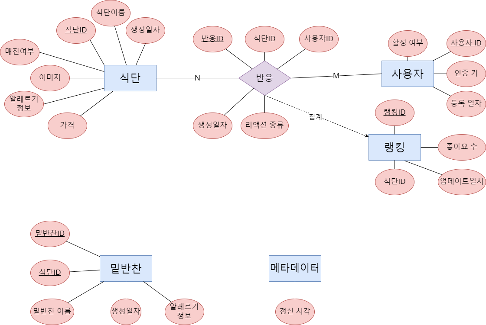

# PDI-APP

## Build
```bash
npm install
npx expo start
```

# 교내 식단 정보 제공 앱 프로젝트

이 프로젝트는 식단 정보 접근의 불편함을 해소하고 관련 정보를 제공하기 위한 목적으로 개발되었습니다.

## 프로젝트 소개

- **개발 인원**: 3명
- **목표**: 식단 정보 접근의 불편함 해소 및 관련 정보 제공
- **주제**: 교내 식단 정보 제공 앱
- **기간**: 2023.11.01 ~ 현재 진행

## Project Plan Docs
- **요구사항 정의서**
  
  

- **구현 프로세스 설계도**
  
  

- **ER다이어그램**
  
  

- **테이블 데이터**
  
  

## 이슈 사항

- **식단 정보 데이터 요청 실패:**
  - 식단 정보를 얻는 과정에서 데이터를 확보하는 데 실패했습니다.
  
- **웹크롤링 불가능한 환경으로 인한 개발 지연:**
  - 예기치 못한 문제로 인해 웹크롤링을 할 수 없는 상황이 발생했습니다. 방학으로 교내식당을 운영X.

- **서비스 제공 불가능한 상황:**
  - 데이터 확보에 실패하고, 웹크롤링이 불가능한 상황으로 인해 서비스 제공이 불가능한 상태입니다.

## 해결 방안

- **백엔드 지식 확보 및 각자의 역량 강화:**
  - 각 팀원들이 백엔드 개발에 필요한 지식을 습득하고 역량을 향상시켜야 합니다.

- **간트 차트를 활용한 이슈 관리:**
  - 각종 이슈들을 간트 차트를 통해 관리하고 우선순위를 정하여 효율적인 프로젝트 관리를 진행해야 합니다.


## 진행 상황 요약

1. **프론트엔드 개발 완료**
   - 구현되는 기능들을 확인하였습니다.

2. **백엔드 개발 진행 예정 (node.js 활용)**
   - 데이터베이스 및 API 구조 설계를 시작할 예정입니다.
   - 필요한 기능과 엔드포인트를 명확히 정의하여 문서화할 계획입니다.

3. **프론트엔드 - 백엔드 연동 진행 예정**
   - API 엔드포인트를 정의하고 개발하여 프론트엔드와 백엔드 간의 통신을 활성화할 예정입니다.
   - 데이터의 주고받음을 위한 형식을 정확히 결정하고 구현할 것입니다.

4. **배포 계획 (알파, 베타 진행 예정)**
   - 알파 및 베타 배포 전에 코드 리뷰 및 테스트를 진행할 예정입니다.
   - 배포 환경을 설정하고 사용자 피드백을 받아 기능을 개선할 예정입니다.
   - 사용자 피드백을 토대로 사용자 경험을 개선하는 방법을 탐색할 것입니다.
